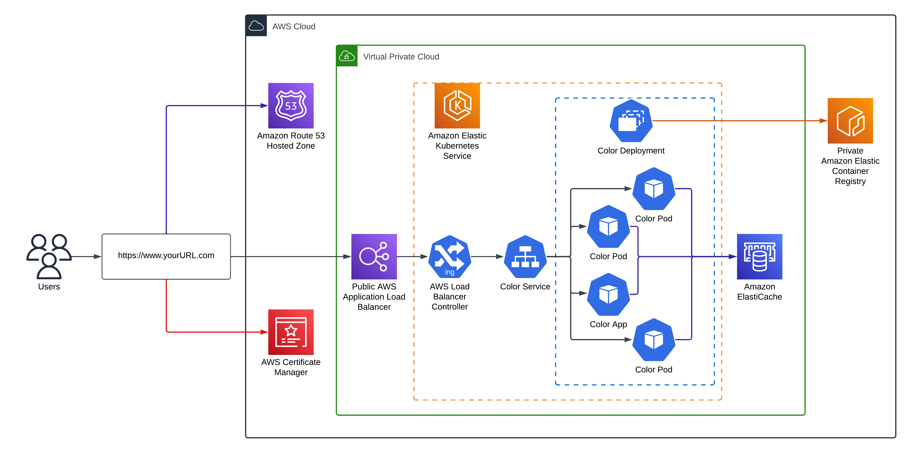
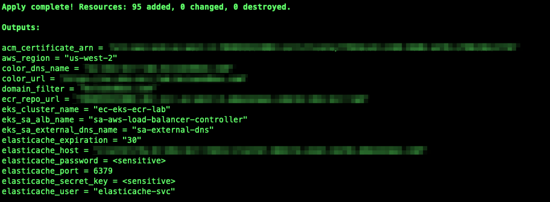
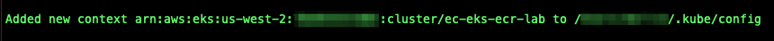
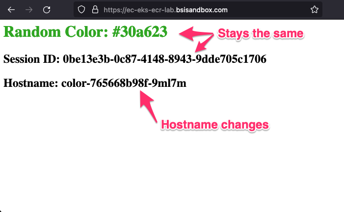
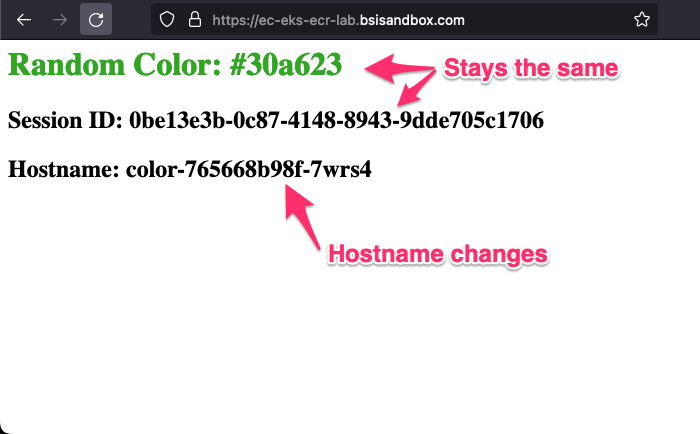
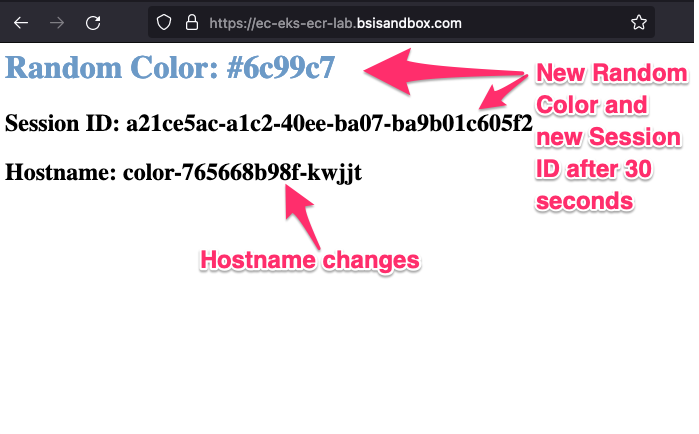
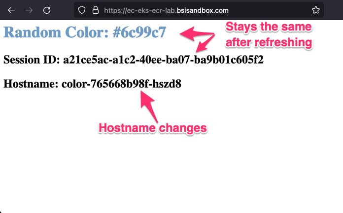
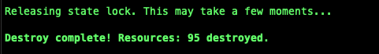

# Using Amazon ElastiCache for Redis as a Session Cache-Store



## Introduction

This guide will show you how to use Amazon ElastiCache for Redis as a distributed cache for user session management. You will use Amazon Elastic Kubernetes Service (EKS) to deploy a Python Flask application. The Python Flask application will randomly create a color cached and store it in the server-side session state to Amazon ElastiCache for Redis. As part of this guide, you will create a container image containing the code for the Python Flask container. You will be uploaded the container image to a private Amazon Elastic Container Registry.

You can access all of the code used in my [GitHub Repository](https://github.com/junglekid/aws-eks-ecr-ec-lab).  

## Table of Contents

1. [Prerequisites](#prerequisites)
2. [Architecture Overview](#architecture-overview)
3. [Setup](#setup)
4. [Configure access to Amazon EKS Cluster](#configure-access-to-amazon-eks-cluster)
5. [Create and Push Docker Image to Amazon ECR](#create-and-push-docker-image-to-amazon-ecr)
   1. [Build the Docker image](#build-the-docker-image)
   2. [Push the Docker image to Amazon ECR](#push-the-docker-image-to-amazon-ecr)
6. [Deploy Supporting Services to Kubernetes](#deploy-supporting-services-to-kubernetes)
   1. [Metrics Server](#metrics-server)
   2. [AWS Load Balancer Controller](#aws-load-balancer-controller)
   3. [External DNS](#external-dns)
7. [Deploy Python Flask Color Application](#deploy-python-flask-color-application)
8. [Verify and Test Python Flask Color Application](#verify-and-test-python-flask-color-application)
9. [Clean Up](#clean-up)
   1. [Clean up Python Flask Color Application from Kubernetes](#clean-up-python-flask-color-application-from-kubernetes)
   2. [Clean up External DNS from Kubernetes](#clean-up-external-dns-from-kubernetes)
   3. [Clean up AWS Load Balancer Controller from Kubernetes](#clean-up-aws-load-balancer-controller-from-kubernetes)
   4. [Clean up Terraform](#clean-up-terraform)

## Prerequisites

Before you begin, make sure you have the following before starting:

1. An active AWS account. You can create a new [AWS account here](https://repost.aws/knowledge-center/create-and-activate-aws-account).
2. AWS CLI installed and configured. Instructions can be found [here](https://aws.amazon.com/cli/).
3. Terraform installed. Instructions can be found [here](https://developer.hashicorp.com/terraform/tutorials/aws-get-started/install-cli).
4. Helm installed. Instructions can be found [here](https://helm.sh/docs/intro/install).
5. Kubernetes CLI (kubectl). Instructions can be found [here](https://kubernetes.io/docs/tasks/tools/#kubectl).

## Architecture Overview

* Amazon ElastiCache
* Amazon Elastic Kubernetes Service (EKS)
* Amazon Elastic Container Registry (ECR)
* AWS Key Management Service (KMS)
* Amazon Route 53
* AWS Certificate Manager (ACM)
* Amazon Virtual Private Cloud (Amazon VPC)
* IAM policies and roles

## Setup

Follow these steps to set up the environment.

1. Set variables in "locals.tf". Below are some of the variables that should be set.

   * aws region
   * aws profile
   * tags
   * custom_domain_name
   * public_domain

2. Update Terraform S3 Backend in provider.tf

   * bucket
   * key
   * profile
   * dynamodb_table

3. Initialize Terraform

   ```bash
   terraform init
   ```

4. Validate the Terraform code

   ```bash
   terraform validate
   ```

5. Run, review, and save a Terraform plan

   ```bash
   terraform plan -out=plan.out
   ```

6. Apply the Terraform plan

   ```bash
   terraform apply plan.out
   ```

7. Review Terraform apply results

   

## Configure access to Amazon EKS Cluster

EKS Cluster details can be extracted from terraform output or from AWS Console to get the name of cluster. This following command can be used to update the kubeconfig in your local machine where you run kubectl commands to interact with your EKS Cluster.

```bash
AWS_REGION=$(terraform output -raw aws_region)
EKS_CLUSTER_NAME=$(terraform output -raw eks_cluster_name)
aws eks --region $AWS_REGION update-kubeconfig --name $EKS_CLUSTER_NAME
```

Results of configuring kubeconfig.



## Create and Push Docker Image to Amazon ECR

## Build the Docker image

Set the variables needed to build and push your Docker image. Navigate to the root of the directory of the GitHub repo and run the following commands:

```bash
AWS_REGION=$(terraform output -raw aws_region)
ECR_REPO=$(terraform output -raw ecr_repo_url)
```

To build the Docker image, run the following command:

```bash
docker build --platform linux/amd64 --no-cache --pull -t ${ECR_REPO}:latest ./color
```

## Push the Docker image to Amazon ECR

To push the Docker image to Amazon ECR, authenticate to your private Amazon ECR registry. To do this, run the following command:

```bash
aws ecr get-login-password --region $AWS_REGION | docker login --username AWS --password-stdin $ECR_REPO
```

Once authenticated, run the following command to push your Docker image to the Amazon ECR repository:

```bash
docker push ${ECR_REPO}:latest
```

## Deploy Supporting Services to Kubernetes

## Metrics Server

To help monitor the health of the EKS Cluster, you can install the Metrics Server. To do this, run the following commands:

```bash
helm repo add metrics-server https://kubernetes-sigs.github.io/metrics-server
helm upgrade --install metrics-server metrics-server/metrics-server \
  --namespace kube-system
```

## AWS Load Balancer Controller

To access Kubernetes services, you need to install an ingress controller. This can be accomplished by installing the AWS Load Balancer Controller. Once this is installed, you can deploy your application, and Kubernetes will create an AWS Application Load Balancer and attach the appropriate pods to it. To install the AWL Load Balancer Controller, run the following commands.

```bash
AWS_REGION=$(terraform output -raw aws_region)
EKS_CLUSTER_NAME=$(terraform output -raw eks_cluster_name)
SA_ALB_NAME=$(terraform output -raw eks_sa_alb_name)
helm repo add eks https://aws.github.io/eks-charts
helm upgrade --install aws-load-balancer-controller eks/aws-load-balancer-controller \
  --namespace kube-system \
  --set region=$AWS_REGION \
  --set clusterName=$EKS_CLUSTER_NAME \
  --set serviceAccount.create=false \
  --set serviceAccount.name=$SA_ALB_NAME
```

## External DNS

To access your application deployed to Kubernetes and exposed through the AWS ALB Controller, you will need to create an external DNS entry. This is where External DNS comes into play. Once deployed and configured correctly, External DNS will register your custom domain name with AWS Route 53. To accomplish this, run the following commands to install External DNS.

```bash
EKS_CLUSTER_NAME=$(terraform output -raw eks_cluster_name)
DOMAIN_FILTER=$(terraform output -raw domain_filter)
SA_EXTERNAL_DNS_NAME=$(terraform output -raw eks_sa_external_dns_name)
helm repo add external-dns https://kubernetes-sigs.github.io/external-dns
helm upgrade --install external-dns external-dns/external-dns \
  --namespace kube-system \
  --set clusterName=$EKS_CLUSTER_NAME \
  --set serviceAccount.create=false \
  --set serviceAccount.name=$SA_EXTERNAL_DNS_NAME \
  --set domainFilters={$DOMAIN_FILTER}
```

## Deploy Python Flask Color Application

To deploy the Python Flask color application, run the following commands:

```bash
ECR_REPO=$(terraform output -raw ecr_repo_url)
ELASTICACHE_HOST=$(terraform output -raw elasticache_host)
ELASTICACHE_PORT=$(terraform output -raw elasticache_port)
ELASTICACHE_USER=$(terraform output -raw elasticache_user)
ELASTICACHE_PASSWORD=$(terraform output -raw elasticache_password)
SESSION_EXPIRATION=$(terraform output -raw elasticache_expiration)
SECRET_KEY=$(terraform output -raw elasticache_secret_key)
ACM_CERTIFICATE_ARN=$(terraform output -raw acm_certificate_arn)
COLOR_DNS_NAME=$(terraform output -raw color_dns_name)
helm upgrade --install color ./charts/color \
  --namespace color \
  --create-namespace \
  --set color.container.image.repository=$ECR_REPO \
  --set configMap.elasticacheHost=$ELASTICACHE_HOST \
  --set configMap.elasticachePort=$ELASTICACHE_PORT \
  --set configMap.elasticacheUser=$ELASTICACHE_USER \
  --set configMap.sessionExpiration=$SESSION_EXPIRATION \
  --set secret.elasticachePassword=$ELASTICACHE_PASSWORD \
  --set secret.secretKey=$SECRET_KEY \
  --set ingress.certificateArn=$ACM_CERTIFICATE_ARN \
  --set ingress.dnsHostname=$COLOR_DNS_NAME
```

## Verify and Test Python Flask Color Application

Let's verify that the Python Flask color application is deployed correctly and that DNS is registered correctly in Amazon Route 53. The Python Flask color application is designed to generate a new color every 30 seconds randomly. You'll need to refresh your web page occasionally to test that the random color stays the same during the 30 seconds. You should notice that the Random Color and Session ID stay the same, but the Hostname will change. This is because the Random Color and the Session ID are stored in Amazon ElastiCache as long as you refresh the web page before it expires, which is 30 seconds. You will always have the same Random Color and Session ID.

1. Verify that the Python Flask Color DNS name is registered correctly with Amazon Route 53.

   **Note:** Your custom domain name may take 5 to 15 minutes to be registered on Amazon Route 53.

   ```bash
   COLOR_DNS_NAME=$(terraform output -raw color_dns_name)
   nslookup $COLOR_DNS_NAME 
   ```

2. Retrieve Python Flask Color URL.

   ```bash
   terraform output color_url
   ```

3. Access the Python Flask Color URL in your favorite web browser

   
   
   
   

4. Immediately refresh the Python Flask Color web page

5. Wait 35 seconds or more and refresh the Python Flask Color web page

   You will notice that the Random Color and Session ID stay the same, but the Hostname changes after each web page refresh.

   

6. Immediately refresh the Python Flask Color web page again.

   Again, the Random Color and Session ID are identical, but the Hostname differs. This is because the session state has not expired.

   

## Clean Up

## Clean up Python Flask Color Application from Kubernetes

1. Uninstall Python Flask Color Application

   **NOTE:** You may need to wait 1 to 5 minutes for resources to be removed properly

   ```bash
   helm uninstall -n color color
   ```

2. Verify Python Flask Color Application was removed successfully

   ```bash
   kubectl -n color get all
   kubectl -n color get ingresses
   ```

## Clean up External DNS from Kubernetes

1. Uninstall External DNS

   **NOTE:** You may need to wait 1 to 5 minutes for resources to be removed properly

   ```bash
   helm uninstall -n kube-system external-dns
   ```

2. Verify External DNS was removed successfully

   ```bash
   kubectl -n kube-system get all -l app.kubernetes.io/name=external-dns
   ```

## Clean up AWS Load Balancer Controller from Kubernetes

1. Uninstall AWS Load Balancer Controller

   ```bash
   helm uninstall -n kube-system aws-load-balancer-controller
   ```

2. Verify AWS Load Balancer Controller was removed successfully

   **NOTE:** May need to wait 1 to 5 minutes for resources to be deleted properly.

   ```bash
   kubectl -n kube-system get all -l app.kubernetes.io/name=aws-load-balancer-controller
   kubectl get ingressclasses -l app.kubernetes.io/name=aws-load-balancer-controller
   ```

## Clean up Terraform

1. Run the following Terraform commands

   ```bash
   terraform destroy
   ```

2. Check Terraform destroy results

   
